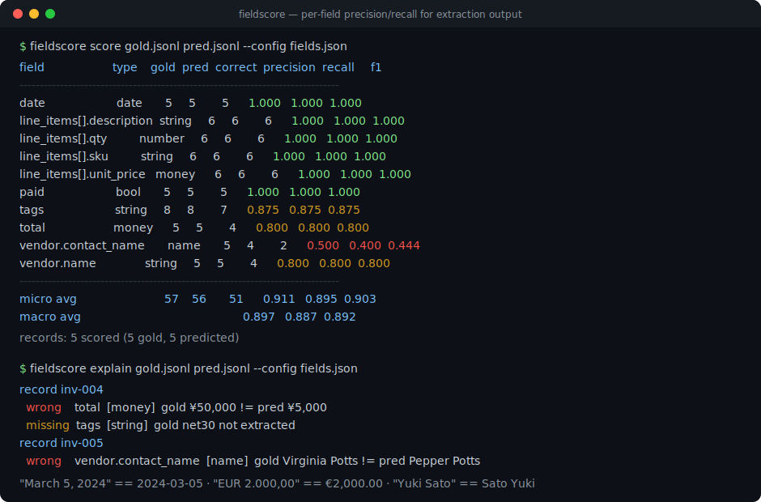
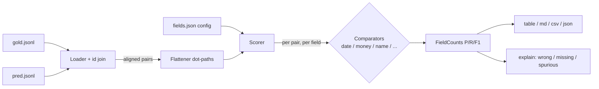

# fieldscore

[English](README.md) | [中文](README.zh.md) | [日本語](README.ja.md)

[](LICENSE) [](CHANGELOG.md) [](pyproject.toml)  [](CONTRIBUTING.md)

**JSON 抽出タスクをフィールド単位で precision/recall 採点するオープンソースツール——嘘をつく完全一致の代わりに、日付・金額・人名を理解するマッチングを CLI 一発で。**



```bash
git clone https://github.com/JaydenCJ/fieldscore && cd fieldscore && pip install -e .
```

> **プレリリース：** fieldscore はまだ PyPI に公開されていません。初回リリースまでは [JaydenCJ/fieldscore](https://github.com/JaydenCJ/fieldscore) をクローンし、リポジトリのルートで `pip install -e .` を実行してください。

## なぜ fieldscore？

構造化抽出はエンタープライズ LLM の主力タスクなのに、その標準的な採点方法はひっそりと間違い続けています。完全一致は `"March 5, 2024"` を `"2024-03-05"` と不一致、`"1234.50 USD"` を `"$1,234.50"` と不一致、`"Smith, Jane"` を `"Jane Smith"` と不一致と判定します——結果、チームは偽のエラー率を飲み込むか、スキーマごとに脆い正規化スクリプトを手書きするか、再現性のない LLM 審判に課金することになります。文字列全体の指標（BLEU、ROUGE、埋め込み類似度）は逆方向にぼやけます：*どのフィールド*が壊れているのか、モデルが頼んでもいない値を幻覚していないかを語れません。fieldscore はフィールドの型を理解するコンパレータで各フィールドを採点し、正解/誤り/欠落/過剰をフィールドごとに集計し、CI のゲートにできる precision・recall・F1 を出力します——オフライン、決定的、標準ライブラリのみ。

|  | fieldscore | 完全一致 | DeepDiff | LLM 審判 | テキスト指標（BLEU/ROUGE） |
|---|---|---|---|---|---|
| フィールド単位の precision / recall / F1 | あり | 自作 | なし（diff であって指標ではない） | なし（大雑把な一点数） | なし（コーパス単位） |
| 日付 / 金額 / 人名の等価判定 | あり | なし | なし | 大抵あるが検証不能 | なし |
| 幻覚フィールドを precision に計上 | あり | 自作 | 列挙のみ、採点せず | まれ | なし |
| 決定的で再現可能な実行 | あり | あり | あり | なし | あり |
| API キーやモデルが必要 | 不要 | 不要 | 不要 | 必要 | 不要 |
| ランタイム依存数 | 0 | 0 | 2 | SDK + SaaS | まちまち |

<sub>依存数は 2026-07 時点で PyPI に宣言されたランタイム要件：deepdiff 8.6.1（2 個：orderly-set、typing-extensions）。fieldscore の依存数は [pyproject.toml](pyproject.toml) の `dependencies = []`。</sub>

## 特徴

- **型を理解するコンパレータ** —— `date` は ISO、`03/05/2024`（`dayfirst` 対応）、`March 5th, 2024`、`20240305`、`2024年3月5日` を読める；`money` は `$1,234.50`、`EUR 2.000,00`、`(45.00)` を許容差つきで揃える；`name` は `Dr. Jane A. Smith`、`Smith, Jane A.`、`J. Smith` を同一人物と判定しつつ、別人は拒否する。
- **データチームがそのまま動ける数字** —— フィールドごとの正解/誤り/欠落/過剰、フィールドごとの precision/recall/F1、micro と macro の平均を、テーブル・markdown・CSV・JSON で出力。
- **明細行を人間のように採点** —— オブジェクトのリストは最良オーバーラップで整列してから採点するので、順序が入れ替わった明細や 1 行のミスは間違えた分だけの減点で済み、表全体を道連れにしない。
- **CI ではコマンド一つ** —— `fieldscore score gold.jsonl pred.jsonl --fail-under 0.9` は micro-F1 が閾値を割ると非ゼロで終了；`fieldscore explain` は全ての不一致と判定したコンパレータを列挙する。
- **タイポが静かに握り潰されない設定** —— 小さな JSON ファイルでフィールドを型と許容差に対応付ける；未知の型やオプションキーはハードエラーで、`fieldscore infer` が gold ファイルから設定の下書きを作る。
- **ランタイム依存ゼロ・完全オフライン** —— 標準ライブラリのみ、モデルなし、API キーなし、テレメトリなし；同じ入力は常に同じ数字を生む。

## クイックスタート

インストール：

```bash
git clone https://github.com/JaydenCJ/fieldscore && cd fieldscore && pip install -e .
```

同梱の請求書サンプルを採点——予測ファイルは gold と異なる日付・金額・人名の書式を使い、さらに本物のミスも混ざっています：

```bash
fieldscore score examples/gold.jsonl examples/pred.jsonl --config examples/fields.json
```

```text
field                     type    gold  pred  correct  precision  recall     f1
-------------------------------------------------------------------------------
date                      date       5     5        5      1.000   1.000  1.000
line_items[].description  string     6     6        6      1.000   1.000  1.000
line_items[].qty          number     6     6        6      1.000   1.000  1.000
line_items[].sku          string     6     6        6      1.000   1.000  1.000
line_items[].unit_price   money      6     6        6      1.000   1.000  1.000
paid                      bool       5     5        5      1.000   1.000  1.000
tags                      string     8     8        7      0.875   0.875  0.875
total                     money      5     5        4      0.800   0.800  0.800
vendor.contact_name       name       5     4        2      0.500   0.400  0.444
vendor.name               string     5     5        4      0.800   0.800  0.800
-------------------------------------------------------------------------------
micro avg                           57    56       51      0.911   0.895  0.903
macro avg                                                  0.897   0.887  0.892

records: 5 scored (5 gold, 5 predicted)
```

書式の違い（`"March 5, 2024"`、`"EUR 2.000,00"`、`"Yuki Sato"`、`paid: "yes"`、順序の違う明細行）は全て正解に；本物のミスはミスのまま。あるフィールドが*なぜ* 1.000 未満なのかを聞くには：

```bash
fieldscore explain examples/gold.jsonl examples/pred.jsonl --config examples/fields.json
```

```text
record inv-002
  wrong    vendor.contact_name  [name]  gold Hans Müller != pred Hans Mueller

record inv-003
  wrong    vendor.name  [string]  gold Initech LLC != pred Initech
  missing  vendor.contact_name  [name]  gold Peter Gibbons not extracted
  spurious tags  [string]  pred annual not in gold

record inv-004
  wrong    total  [money]  gold ¥50,000 != pred ¥5,000
  missing  tags  [string]  gold net30 not extracted

record inv-005
  wrong    vendor.contact_name  [name]  gold Virginia Potts != pred Pepper Potts
```

CI ジョブでスコアをゲートし、自分のスキーマ用の設定を下書きする：

```bash
fieldscore score gold.jsonl pred.jsonl --config fields.json --fail-under 0.9
fieldscore infer gold.jsonl --id-field invoice_id > fields.json
```

## コンパレータ

| 型 | オプション（デフォルト） | 等価と判定する例 |
|---|---|---|
| `date` | `dayfirst`（false） | `2024-03-05` == `March 5th, 2024` == `05/03/2024` == `2024年3月5日` |
| `money` | `tolerance`（0）、`require_currency`（false） | `$1,234.50` == `1234.5 USD`；`€2,000.00` == `EUR 2.000,00`；`100 USD` と `100 EUR` は決して等しくない |
| `name` | `subset_ok`（false） | `Dr. Jane A. Smith` == `Smith, Jane A.` == `J. Smith`（イニシャル）；別人は決して等しくない |
| `number` | `abs_tol`（0）、`rel_tol`（1e-9） | `10` == `"10.0"`；`"1,000"` == `1000`；`"12%"` は 12 として解析 |
| `bool` | — | `true` == `"yes"` == `"1"` |
| `string` | `mode`（normalized）、`threshold`（0.9） | モード：`exact`、`casefold`、`normalized`、`fuzzy` |
| `auto` | `dayfirst`（false） | ペアごとに検出：bool → date → money → number → テキスト（デフォルト型） |

設定キー：`id_field`（id でレコードを結合）、`dayfirst`、`default_type`、そして `total` や `line_items[].unit_price` のようなパスを spec に対応付ける `fields`；リストフィールドに `"ordered": true` を書くと要素順を固定できます。正確な集計ルール——何が誤り・欠落・過剰なのか、オブジェクトリストの整列方法、なぜ `null` がキー省略と同じなのか——は [`docs/scoring.md`](docs/scoring.md) に明記しています。

## 検証

このリポジトリは CI を持ちません；上記の全ての主張はローカル実行で検証しています。このリポジトリのチェックアウトから再現できます：

```bash
pip install -e '.[dev]' && pytest && bash scripts/smoke.sh
```

出力（実際の実行からコピー、`...` で省略）：

```text
92 passed in 0.59s
...
SMOKE OK
```

## アーキテクチャ



## ロードマップ

- [x] 7 種のコンパレータ、ネスト/リスト採点、id 結合アライメント、4 種の出力形式、`score`/`explain`/`infer` CLI、`--fail-under` ゲート（v0.1.0）
- [ ] PyPI へ公開し `pip install fieldscore` を可能に
- [ ] 住所・電話番号コンパレータ、entry points 経由のカスタムコンパレータ
- [ ] 予測がフィールド別信頼度を持つ場合の重み付き採点
- [ ] ドキュメントのセグメント別にスコアを切り出せるレコード単位 JSON 出力

完全なリストは [open issues](https://github.com/JaydenCJ/fieldscore/issues) を参照してください。

## コントリビュート

コントリビュート歓迎です——まずは [good first issue](https://github.com/JaydenCJ/fieldscore/issues?q=is%3Aissue+is%3Aopen+label%3A%22good+first+issue%22) から、あるいは [discussion](https://github.com/JaydenCJ/fieldscore/discussions) を立ててください。開発環境は [CONTRIBUTING.md](CONTRIBUTING.md) を参照。

## ライセンス

[MIT](LICENSE)
