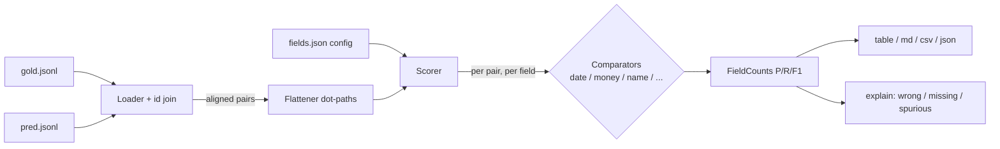

# fieldscore

[English](README.md) | [中文](README.zh.md) | [日本語](README.ja.md)

[](LICENSE) [](CHANGELOG.md) [](pyproject.toml)  [](CONTRIBUTING.md)

**Open-source per-field precision/recall scoring for JSON extraction tasks — date/money/name-aware matching instead of exact-string lies, from one CLI command.**


```bash
git clone https://github.com/JaydenCJ/fieldscore && cd fieldscore && pip install -e .
```

> **Pre-release:** fieldscore is not yet published to PyPI. Until the first release, clone [JaydenCJ/fieldscore](https://github.com/JaydenCJ/fieldscore) and run `pip install -e .` from the repository root.

## Why fieldscore?

Structured extraction is the workhorse enterprise LLM task, and the standard way of scoring it is quietly wrong. Exact-match calls `"March 5, 2024"` a failure against `"2024-03-05"`, `"1234.50 USD"` a failure against `"$1,234.50"`, and `"Smith, Jane"` a failure against `"Jane Smith"` — so teams either eat a fake error rate, hand-write brittle normalizers per schema, or pay an LLM judge to grade nondeterministically. Whole-string metrics (BLEU, ROUGE, embedding similarity) blur in the other direction: they cannot tell you *which field* is failing or whether the model hallucinates values it was never asked for. fieldscore scores every field with a comparator that understands its type, tallies correct / wrong / missing / spurious per field, and prints precision, recall, and F1 you can gate CI on — offline, deterministic, standard library only.

|  | fieldscore | exact match | DeepDiff | LLM-as-judge | text metrics (BLEU/ROUGE) |
|---|---|---|---|---|---|
| Per-field precision / recall / F1 | Yes | DIY | No (diff, not metrics) | No (one holistic score) | No (corpus-level) |
| Date / money / name equivalence | Yes | No | No | Usually, unverifiably | No |
| Hallucinated fields counted against precision | Yes | DIY | Listed, not scored | Rarely | No |
| Deterministic, reproducible runs | Yes | Yes | Yes | No | Yes |
| Needs an API key or model | No | No | No | Yes | No |
| Runtime dependencies | 0 | 0 | 2 | SDK + SaaS | varies |

<sub>Dependency counts are declared runtime requirements on PyPI as of 2026-07: deepdiff 8.6.1 (2: orderly-set, typing-extensions). fieldscore's count is `dependencies = []` in [pyproject.toml](pyproject.toml).</sub>

## Features

- **Type-aware comparators** — `date` reads ISO, `03/05/2024` (with `dayfirst`), `March 5th, 2024`, `20240305`, and `2024年3月5日`; `money` resolves `$1,234.50` vs `EUR 2.000,00` vs `(45.00)` with tolerances; `name` equates `Dr. Jane A. Smith`, `Smith, Jane A.`, and `J. Smith` while still rejecting different people.
- **Numbers a data team can act on** — correct / wrong / missing / spurious per field, precision / recall / F1 per field, micro and macro averages, in table, markdown, CSV, or JSON.
- **Line items scored like a human would** — lists of objects are aligned by best overlap before scoring, so a reordered or one-off line item costs exactly what it got wrong, not the whole table.
- **One command in CI** — `fieldscore score gold.jsonl pred.jsonl --fail-under 0.9` exits non-zero when micro-F1 drops; `fieldscore explain` names every mismatch and the comparator that judged it.
- **Config you can't typo silently** — a small JSON file maps fields to types and tolerances; unknown types or option keys are hard errors, and `fieldscore infer` drafts the config from your gold file.
- **Zero runtime dependencies, fully offline** — standard library only, no model, no API key, no telemetry; the same input always produces the same numbers.

## Quickstart

Install:

```bash
git clone https://github.com/JaydenCJ/fieldscore && cd fieldscore && pip install -e .
```

Score the bundled invoice example — the predictions use different date, money, and name formats than the gold file, plus a few genuine errors:

```bash
fieldscore score examples/gold.jsonl examples/pred.jsonl --config examples/fields.json
```

```text
field                     type    gold  pred  correct  precision  recall     f1
-------------------------------------------------------------------------------
date                      date       5     5        5      1.000   1.000  1.000
line_items[].description  string     6     6        6      1.000   1.000  1.000
line_items[].qty          number     6     6        6      1.000   1.000  1.000
line_items[].sku          string     6     6        6      1.000   1.000  1.000
line_items[].unit_price   money      6     6        6      1.000   1.000  1.000
paid                      bool       5     5        5      1.000   1.000  1.000
tags                      string     8     8        7      0.875   0.875  0.875
total                     money      5     5        4      0.800   0.800  0.800
vendor.contact_name       name       5     4        2      0.500   0.400  0.444
vendor.name               string     5     5        4      0.800   0.800  0.800
-------------------------------------------------------------------------------
micro avg                           57    56       51      0.911   0.895  0.903
macro avg                                                  0.897   0.887  0.892

records: 5 scored (5 gold, 5 predicted)
```

Every format difference (`"March 5, 2024"`, `"EUR 2.000,00"`, `"Yuki Sato"`, `paid: "yes"`, reordered line items) scored as correct; every real error stayed an error. Ask *why* a field is below 1.000:

```bash
fieldscore explain examples/gold.jsonl examples/pred.jsonl --config examples/fields.json
```

```text
record inv-002
  wrong    vendor.contact_name  [name]  gold Hans Müller != pred Hans Mueller

record inv-003
  wrong    vendor.name  [string]  gold Initech LLC != pred Initech
  missing  vendor.contact_name  [name]  gold Peter Gibbons not extracted
  spurious tags  [string]  pred annual not in gold

record inv-004
  wrong    total  [money]  gold ¥50,000 != pred ¥5,000
  missing  tags  [string]  gold net30 not extracted

record inv-005
  wrong    vendor.contact_name  [name]  gold Virginia Potts != pred Pepper Potts
```

Gate a CI job on the score, and draft a config for your own schema:

```bash
fieldscore score gold.jsonl pred.jsonl --config fields.json --fail-under 0.9
fieldscore infer gold.jsonl --id-field invoice_id > fields.json
```

## Comparators

| Type | Options (default) | Accepts as equal |
|---|---|---|
| `date` | `dayfirst` (false) | `2024-03-05` == `March 5th, 2024` == `05/03/2024` == `2024年3月5日` |
| `money` | `tolerance` (0), `require_currency` (false) | `$1,234.50` == `1234.5 USD`; `€2,000.00` == `EUR 2.000,00`; never `100 USD` == `100 EUR` |
| `name` | `subset_ok` (false) | `Dr. Jane A. Smith` == `Smith, Jane A.` == `J. Smith` (initials); never a different person |
| `number` | `abs_tol` (0), `rel_tol` (1e-9) | `10` == `"10.0"`; `"1,000"` == `1000`; `"12%"` parses as 12 |
| `bool` | — | `true` == `"yes"` == `"1"` |
| `string` | `mode` (normalized), `threshold` (0.9) | modes: `exact`, `casefold`, `normalized`, `fuzzy` |
| `auto` | `dayfirst` (false) | per-pair detection: bool → date → money → number → text (the default type) |

Config keys: `id_field` (join records by id), `dayfirst`, `default_type`, and `fields` mapping paths like `total` or `line_items[].unit_price` to specs; `"ordered": true` on a list field pins element order. The exact counting rules — what is wrong vs missing vs spurious, how object lists align, why `null` equals an omitted key — are specified in [`docs/scoring.md`](docs/scoring.md).

## Verification

This repository ships no CI; every claim above is verified by local runs. Reproduce them from a checkout of this repository:

```bash
pip install -e '.[dev]' && pytest && bash scripts/smoke.sh
```

Output (copied from a real run, truncated with `...`):

```text
92 passed in 0.59s
...
SMOKE OK
```

## Architecture



## Roadmap

- [x] Seven comparators, nested/list scoring, id-join alignment, four output formats, `score`/`explain`/`infer` CLI, `--fail-under` gate (v0.1.0)
- [ ] PyPI release with `pip install fieldscore`
- [ ] Address and phone comparators, pluggable custom comparators via entry points
- [ ] Confidence-weighted scoring when predictions carry per-field scores
- [ ] Per-record JSON output for slicing scores by document segment

See the [open issues](https://github.com/JaydenCJ/fieldscore/issues) for the full list.

## Contributing

Contributions are welcome — start with a [good first issue](https://github.com/JaydenCJ/fieldscore/issues?q=is%3Aissue+is%3Aopen+label%3A%22good+first+issue%22) or open a [discussion](https://github.com/JaydenCJ/fieldscore/discussions). See [CONTRIBUTING.md](CONTRIBUTING.md) for the development setup.

## License

[MIT](LICENSE)
