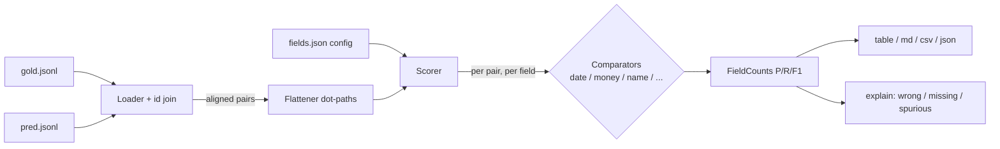

# fieldscore

[English](README.md) | [中文](README.zh.md) | [日本語](README.ja.md)

[](LICENSE) [](CHANGELOG.md) [](pyproject.toml)  [](CONTRIBUTING.md)

**开源的 JSON 抽取任务逐字段精确率/召回率评分工具——用理解日期/金额/人名的匹配替代撒谎的字符串精确匹配，一条 CLI 命令搞定。**


```bash
git clone https://github.com/JaydenCJ/fieldscore && cd fieldscore && pip install -e .
```

> **预发布：** fieldscore 尚未发布到 PyPI。在首个正式版之前，请克隆 [JaydenCJ/fieldscore](https://github.com/JaydenCJ/fieldscore) 并在仓库根目录执行 `pip install -e .`。

## 为什么选 fieldscore？

结构化抽取是企业级 LLM 的主力任务，而它的标准评分方式一直在悄悄出错。精确匹配把 `"March 5, 2024"` 判为与 `"2024-03-05"` 不符、把 `"1234.50 USD"` 判为与 `"$1,234.50"` 不符、把 `"Smith, Jane"` 判为与 `"Jane Smith"` 不符——于是团队要么忍受虚假的错误率，要么为每个 schema 手写脆弱的归一化脚本，要么花钱请一个不可复现的 LLM 裁判。整串文本指标（BLEU、ROUGE、向量相似度）则往另一个方向糊掉：它们说不出*哪个字段*在出错，也看不出模型是否幻觉出了没人要的值。fieldscore 用理解字段类型的比较器为每个字段打分，逐字段统计正确/错误/漏抽/多抽，并输出可以直接卡 CI 的精确率、召回率和 F1——离线、确定性、纯标准库。

|  | fieldscore | 精确匹配 | DeepDiff | LLM 裁判 | 文本指标（BLEU/ROUGE） |
|---|---|---|---|---|---|
| 逐字段精确率 / 召回率 / F1 | 有 | 自己造 | 无（只是 diff，不是指标） | 无（一个笼统分数） | 无（语料级） |
| 日期 / 金额 / 人名等价判断 | 有 | 无 | 无 | 通常有，但无法验证 | 无 |
| 幻觉字段计入精确率 | 有 | 自己造 | 只列出，不计分 | 很少 | 无 |
| 确定性、可复现的运行 | 有 | 有 | 有 | 无 | 有 |
| 需要 API key 或模型 | 不需要 | 不需要 | 不需要 | 需要 | 不需要 |
| 运行时依赖数 | 0 | 0 | 2 | SDK + SaaS | 不定 |

<sub>依赖数为 2026-07 时 PyPI 上声明的运行时依赖：deepdiff 8.6.1（2 个：orderly-set、typing-extensions）。fieldscore 的依赖数见 [pyproject.toml](pyproject.toml) 中的 `dependencies = []`。</sub>

## 功能

- **理解类型的比较器** —— `date` 能读 ISO、`03/05/2024`（配 `dayfirst`）、`March 5th, 2024`、`20240305` 和 `2024年3月5日`；`money` 能在容差内对齐 `$1,234.50`、`EUR 2.000,00` 与 `(45.00)`；`name` 把 `Dr. Jane A. Smith`、`Smith, Jane A.` 和 `J. Smith` 判为同一人，同时仍拒绝不同的人。
- **数据团队能直接行动的数字** —— 逐字段的正确/错误/漏抽/多抽，逐字段的精确率/召回率/F1，micro 与 macro 平均，支持表格、markdown、CSV、JSON 输出。
- **像人一样给行项目打分** —— 对象列表先按最佳重叠对齐再评分，行项目乱序或错一行只扣它错的那部分，不会拖垮整张表。
- **CI 里只要一条命令** —— `fieldscore score gold.jsonl pred.jsonl --fail-under 0.9` 在 micro-F1 跌破阈值时以非零码退出；`fieldscore explain` 列出每处不匹配及做出判定的比较器。
- **写错了不会被静默吞掉的配置** —— 一个小 JSON 文件把字段映射到类型与容差；未知类型或选项键是硬错误，`fieldscore infer` 还能从 gold 文件起草配置。
- **零运行时依赖、完全离线** —— 纯标准库，无模型、无 API key、无遥测；同样的输入永远产出同样的数字。

## 快速上手

安装：

```bash
git clone https://github.com/JaydenCJ/fieldscore && cd fieldscore && pip install -e .
```

给自带的发票示例打分——预测文件用了与 gold 不同的日期、金额、人名格式，外加几个真正的错误：

```bash
fieldscore score examples/gold.jsonl examples/pred.jsonl --config examples/fields.json
```

```text
field                     type    gold  pred  correct  precision  recall     f1
-------------------------------------------------------------------------------
date                      date       5     5        5      1.000   1.000  1.000
line_items[].description  string     6     6        6      1.000   1.000  1.000
line_items[].qty          number     6     6        6      1.000   1.000  1.000
line_items[].sku          string     6     6        6      1.000   1.000  1.000
line_items[].unit_price   money      6     6        6      1.000   1.000  1.000
paid                      bool       5     5        5      1.000   1.000  1.000
tags                      string     8     8        7      0.875   0.875  0.875
total                     money      5     5        4      0.800   0.800  0.800
vendor.contact_name       name       5     4        2      0.500   0.400  0.444
vendor.name               string     5     5        4      0.800   0.800  0.800
-------------------------------------------------------------------------------
micro avg                           57    56       51      0.911   0.895  0.903
macro avg                                                  0.897   0.887  0.892

records: 5 scored (5 gold, 5 predicted)
```

所有格式差异（`"March 5, 2024"`、`"EUR 2.000,00"`、`"Yuki Sato"`、`paid: "yes"`、乱序的行项目）都判为正确；所有真实错误依然是错误。想知道某个字段*为什么*低于 1.000：

```bash
fieldscore explain examples/gold.jsonl examples/pred.jsonl --config examples/fields.json
```

```text
record inv-002
  wrong    vendor.contact_name  [name]  gold Hans Müller != pred Hans Mueller

record inv-003
  wrong    vendor.name  [string]  gold Initech LLC != pred Initech
  missing  vendor.contact_name  [name]  gold Peter Gibbons not extracted
  spurious tags  [string]  pred annual not in gold

record inv-004
  wrong    total  [money]  gold ¥50,000 != pred ¥5,000
  missing  tags  [string]  gold net30 not extracted

record inv-005
  wrong    vendor.contact_name  [name]  gold Virginia Potts != pred Pepper Potts
```

在 CI 任务里卡分数，并为你自己的 schema 起草配置：

```bash
fieldscore score gold.jsonl pred.jsonl --config fields.json --fail-under 0.9
fieldscore infer gold.jsonl --id-field invoice_id > fields.json
```

## 比较器

| 类型 | 选项（默认值） | 判为相等的例子 |
|---|---|---|
| `date` | `dayfirst`（false） | `2024-03-05` == `March 5th, 2024` == `05/03/2024` == `2024年3月5日` |
| `money` | `tolerance`（0）、`require_currency`（false） | `$1,234.50` == `1234.5 USD`；`€2,000.00` == `EUR 2.000,00`；`100 USD` 永不等于 `100 EUR` |
| `name` | `subset_ok`（false） | `Dr. Jane A. Smith` == `Smith, Jane A.` == `J. Smith`（首字母）；不同的人永不相等 |
| `number` | `abs_tol`（0）、`rel_tol`（1e-9） | `10` == `"10.0"`；`"1,000"` == `1000`；`"12%"` 解析为 12 |
| `bool` | — | `true` == `"yes"` == `"1"` |
| `string` | `mode`（normalized）、`threshold`（0.9） | 模式：`exact`、`casefold`、`normalized`、`fuzzy` |
| `auto` | `dayfirst`（false） | 逐对检测：bool → date → money → number → 文本（默认类型） |

配置键：`id_field`（按 id 连接记录）、`dayfirst`、`default_type`，以及把 `total`、`line_items[].unit_price` 这类路径映射到 spec 的 `fields`；在列表字段上写 `"ordered": true` 可固定元素顺序。精确的计数规则——什么算错误、漏抽、多抽，对象列表如何对齐，为什么 `null` 等同于省略键——都写在 [`docs/scoring.md`](docs/scoring.md)。

## 验证

本仓库不带 CI；上面每一条声明都由本地运行验证。从本仓库的 checkout 即可复现：

```bash
pip install -e '.[dev]' && pytest && bash scripts/smoke.sh
```

输出（摘自一次真实运行，用 `...` 截断）：

```text
92 passed in 0.59s
...
SMOKE OK
```

## 架构



## 路线图

- [x] 七种比较器、嵌套/列表评分、id 连接对齐、四种输出格式、`score`/`explain`/`infer` CLI、`--fail-under` 关卡（v0.1.0）
- [ ] 发布到 PyPI，支持 `pip install fieldscore`
- [ ] 地址与电话比较器，通过 entry points 插入自定义比较器
- [ ] 当预测带有逐字段置信度时的加权评分
- [ ] 逐记录 JSON 输出，便于按文档切片分析分数

完整列表见 [open issues](https://github.com/JaydenCJ/fieldscore/issues)。

## 贡献

欢迎贡献——从 [good first issue](https://github.com/JaydenCJ/fieldscore/issues?q=is%3Aissue+is%3Aopen+label%3A%22good+first+issue%22) 开始，或发起 [discussion](https://github.com/JaydenCJ/fieldscore/discussions)。开发环境搭建见 [CONTRIBUTING.md](CONTRIBUTING.md)。

## 许可证

[MIT](LICENSE)
